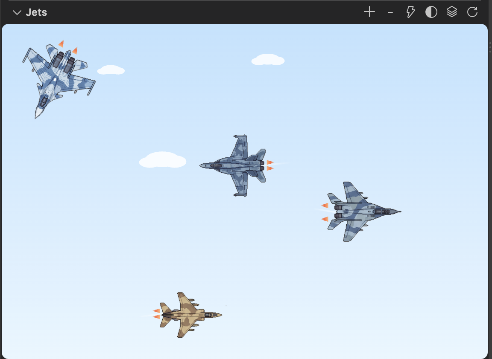
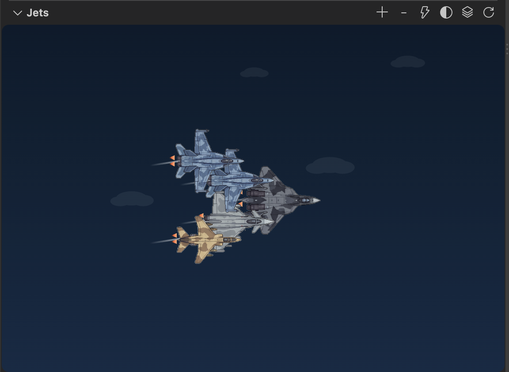

# Jets

A squadron of fighter jets buzzes around your Explorer sidebar — [vscode-pets](https://marketplace.visualstudio.com/items?itemName=tonybaloney.vscode-pets), but fighter jets instead of pets.

## Features

- Eleven real aircraft to fly: **F-16 Fighting Falcon**, **F-22 Raptor**, **F/A-18 Hornet**, **Su-57 Felon**, **Su-30 Flanker-C**, **Su-25 Frogfoot**, **Eurofighter Typhoon**, **SEPECAT Jaguar**, **MiG-21 Fishbed**, **MiG-29 Fulcrum**, and **Mirage 2000**.
- Each jet flies its own straight-line flight path — cruising, banking turns at the edges, changing altitude, and the occasional barrel roll.
- Click a jet to trigger its afterburner; click empty sky to make a random jet do a loop.
- Fly a full squadron at once (up to 6 jets) — add and remove them from the panel's title bar.
- Group the squadron into a formation — V, line abreast, echelon, diamond, or trail — with the wingmen tracking the lead jet.
- Toggle the sky between day and night.
- Positions, aircraft choices, formation, and sky preference all persist across reloads.

## Usage

Open the **Explorer** sidebar (`Cmd/Ctrl+Shift+E`) — the "Jets" section sits below your file tree. Use the icons in its title bar to:

| Icon | Action |
| --- | --- |
| ➕ | Add a jet (opens a picker to choose which aircraft) |
| ➖ | Remove the most recently added jet |
| ⚡ | Trigger every jet's afterburner |
| 🌗 | Toggle day/night sky |
| 🗂️ | Set a formation, or choose None to return to free flight |
| ↻ | Reset to a single jet |

## License

MIT
